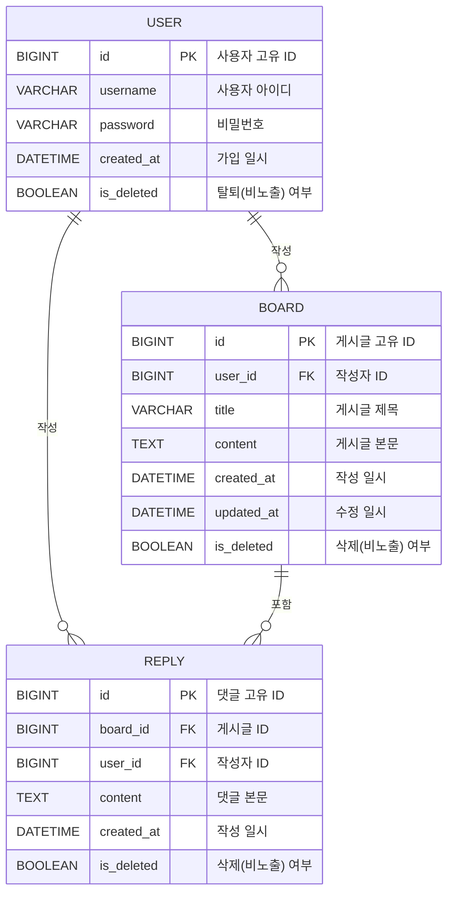

# ERD (Entity Relationship Diagram)

기능 명세서를 바탕으로 도출된 데이터베이스 구조입니다. 코드베이스 명명 규칙(Board, Reply)과 소프트 딜리트 정책을 반영하였습니다.

## Mermaid ERD

## 테이블 명세

### 1. USER (사용자)
- **id** (PK): 고유 식별자
- **username**: 로그인 아이디
- **password**: 로그인 비밀번호 (Bcrypt 등 암호화 저장)
- **created_at**: 계정 생성 시간
- **is_deleted**: 회원 탈퇴 여부 (true일 경우 관련된 Board, Reply를 비노출 처리)

### 2. BOARD (게시글)
- **id** (PK): 게시글 식별자
- **user_id** (FK): 작성자의 식별자 (`USER.id` 참조)
- **title**: 게시글의 제목
- **content**: 게시글의 본문 텍스트
- **created_at**: 최초 작성 시간
- **updated_at**: 마지막 수정 시간
- **is_deleted**: 게시글 삭제 상태 (소프트 딜리트)

### 3. REPLY (댓글)
- **id** (PK): 댓글 식별자
- **board_id** (FK): 댓글이 달린 게시글 식별자 (`BOARD.id` 참조)
- **user_id** (FK): 댓글 작성자의 식별자 (`USER.id` 참조)
- **content**: 댓글의 본문 텍스트
- **created_at**: 작성 시간 (수정 기능 미지원으로 updated_at 없음)
- **is_deleted**: 댓글 삭제 상태 (소프트 딜리트)
